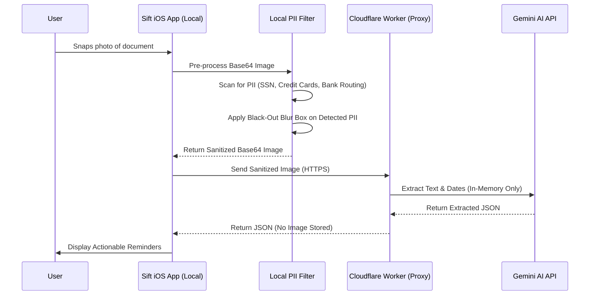

# 🚀 Sift: "Smart Profile" Multi-Domain Product & Architecture Specification

This document defines the comprehensive product strategy, database architecture, Gemini AI prompt system, UX navigation, and privacy/PII redaction model for **Sift Pivot Option C: The Smart Profile Approach**.

---

## Executive Summary

Sift evolves from a single-purpose *School Flyer Scanner* into a **Dynamic Multi-Profile Paperwork Command Center**. Upon first launch, users select their primary paperwork burden. Sift dynamically adapts its UI theme, AI extraction fields, database views, and alarm logic to match the selected profile.

---

## 1. Profile Matrix & Target Audience Pain Points

### Onboarding Selection Options

| Profile Icon & Name | Target Audience | Primary Paper Burden | Core Pain Point Addressed |
| :--- | :--- | :--- | :--- |
| 🎒 **School & Family** | Parents (1–3 kids) | School flyers, permission slips, spirit week schedules, sports rosters | Missing spirit days, failing to return signed permission slips, forgotten bake sale fees. |
| 🩺 **Elder Care & Health** | Adult caregivers, chronic care patients | Pre-op directives, doctor visit prep sheets, lab work instructions, Rx refills | Sleep-deprived caregivers missing fasting windows before surgery or forgetting critical medication holds. |
| 🛠️ **Small Business & Trades** | Plumbers, electricians, landscapers, solo contractors | Net-30 vendor invoices, city building permits, vehicle inspection slips, license renewals | Paying \$50–\$200 vendor late fees, halted job sites due to expired permits, lost tax-deductible receipts. |
| 🏡 **Property & HOA** *(Bonus Profile)* | Landlords, HOA board members, tenants | HOA violation notices, utility shutoff warnings, contractor repair quotes, lease renewals | Unplanned HOA fines, missed property tax deadlines, forgotten HVAC maintenance schedules. |

---

## 2. Gemini AI Prompt System & Extraction Fields

When a document is scanned, Sift passes the active `profile_id` to the Cloudflare Proxy (`sift-gemini-proxy`), which injects tailored system instructions.

### Profile Extraction Field Mapping

```typescript
export interface ProfileExtractionSchema {
  school: {
    student_name?: string;
    event_type: 'permission_slip' | 'spirit_day' | 'fundraiser' | 'general';
    cost?: number;
    parent_signature_required: boolean;
    snack_duty: boolean;
  };
  elderCare: {
    patient_name?: string;
    provider_clinic?: string;
    pre_op_fasting_hours?: number;
    medication_hold_instructions?: string;
    rx_refill_date?: string;
    claim_deadline?: string;
  };
  smallBiz: {
    vendor_client_name?: string;
    total_amount?: number;
    payment_terms?: 'Net-15' | 'Net-30' | 'Net-60' | 'Due Upon Receipt';
    invoice_due_date?: string;
    permit_expiration_date?: string;
    tax_category?: string;
  };
  property: {
    property_address?: string;
    tenant_name?: string;
    fine_amount?: number;
    utility_shutoff_date?: string;
    inspection_date?: string;
  };
}
```

### System Instruction Snippets (Cloudflare Worker Prompt Engine)

```typescript
const PROFILE_PROMPTS = {
  school: `Extract school flyer details: Title, due date, time, event type, student name, dollar amount, signature required.`,
  elderCare: `Extract medical & caregiver directives: Patient name, clinic/doctor, appointment date/time, pre-op fasting hours, medication hold instructions, and urgent care alerts. Set is_urgent=true if fasting or medication holds are detected.`,
  smallBiz: `Extract business invoice & permit details: Vendor/Client name, total dollar amount, payment terms (Net-30), invoice due date, permit expiration date, and tax category.`,
  property: `Extract property & HOA details: Property address, HOA violation fine, utility shutoff date, contractor quote amount, and inspection deadline.`
};
```

---

## 3. Dynamic UX Navigation & Tailored Views

The bottom tab navigator dynamically adjusts its screens based on the active `user_profile`:

```mermaid
graph TD
    AppLaunch[App Launch] --> CheckOnboarding{Onboarded?}
    CheckOnboarding -- No --> ProfileOnboarding[Profile Selection Screen]
    ProfileOnboarding --> SetProfile[Save Profile in SQLite]
    SetProfile --> MainTab
    CheckOnboarding -- Yes --> MainTab[Dynamic Bottom Tab Navigator]

    subgraph Dynamic Tabs by Profile
        MainTab --> |School Profile| TabSchool[Actionable | Informational | Quick Scan | Settings]
        MainTab --> |ElderCare Profile| TabCare[Directives & Preps | Rx & Records | Quick Scan | Settings]
        MainTab --> |SmallBiz Profile| TabBiz[Unpaid Invoices | Permits & Receipts | Quick Scan | Accounting Export]
        MainTab --> |Property Profile| TabProp[Pending Actions | Notices & Quotes | Quick Scan | Settings]
    end
```

### Visual Styling & Contextual Themes

Each profile applies a distinct, high-contrast theme token:

| Profile | Primary Accent | Secondary Badge | Contextual Empty State |
| :--- | :--- | :--- | :--- |
| 🎒 **School** | Indigo (`#6366f1`) | Amber (`#f59e0b`) | *"No pending school flyers! Enjoy your quiet fridge."* |
| 🩺 **Elder Care** | Teal (`#0d9488`) | Rose (`#f43f5e`) | *"All care directives & doctor preps are organized."* |
| 🛠️ **Small Biz** | Emerald (`#10b981`) | Slate (`#334155`) | *"No unpaid invoices or expiring permits found!"* |
| 🏡 **Property** | Cyan (`#06b6d4`) | Violet (`#8b5cf6`) | *"Property notices and tenant quotes up to date."* |

---

## 4. Database Schema (SQLite `sift_v2.db`)

Sift uses a **Hybrid Single-Table + Metadata JSON** model. This keeps local SQLite queries lighting fast while allowing profile-specific fields without complex schema migrations.

```sql
-- Core Documents Table
CREATE TABLE IF NOT EXISTS documents (
  id TEXT PRIMARY KEY NOT NULL,
  origin TEXT NOT NULL,
  filename TEXT NOT NULL,
  mime TEXT NOT NULL,
  image_path TEXT,
  created_at TEXT NOT NULL
);

-- Core Items Table with Profile Tagging & JSON Extension Metadata
CREATE TABLE IF NOT EXISTS items (
  id TEXT PRIMARY KEY NOT NULL,
  document_id TEXT NOT NULL,
  profile_id TEXT NOT NULL DEFAULT 'school', -- 'school' | 'elderCare' | 'smallBiz' | 'property'
  tab TEXT NOT NULL,                         -- 'actionable' | 'informational'
  title TEXT NOT NULL,
  notes TEXT,
  due_at TEXT,
  source_snippet TEXT NOT NULL,
  status TEXT NOT NULL DEFAULT 'open',      -- 'open' | 'done' | 'archived'
  is_urgent INTEGER NOT NULL DEFAULT 0,
  reminder_at TEXT,
  notification_id TEXT,
  confidence TEXT NOT NULL DEFAULT 'high',
  
  -- Flexible JSON column for profile-specific fields
  -- e.g. {"total_amount": 450.00, "vendor": "Home Depot", "net_terms": "Net-30"}
  metadata_json TEXT, 

  created_at TEXT NOT NULL,
  updated_at TEXT NOT NULL,
  FOREIGN KEY (document_id) REFERENCES documents (id) ON DELETE CASCADE
);

-- User Profile Preferences & Active State
CREATE TABLE IF NOT EXISTS user_preferences (
  id INTEGER PRIMARY KEY CHECK (id = 1),
  active_profile TEXT NOT NULL DEFAULT 'school',
  enabled_profiles_json TEXT NOT NULL DEFAULT '["school","elderCare","smallBiz","property"]',
  enable_notifications INTEGER NOT NULL DEFAULT 1,
  enable_critical_alerts INTEGER NOT NULL DEFAULT 0,
  default_reminder_time TEXT NOT NULL DEFAULT '19:00_nightbefore',
  auto_delete_period TEXT NOT NULL DEFAULT 'never',
  free_scans_used INTEGER NOT NULL DEFAULT 0,
  is_subscribed INTEGER NOT NULL DEFAULT 0,
  active_plan_id TEXT
);
```

---

## 5. Security, Privacy & On-Device PII Redaction Strategy

When users scan medical records, tax invoices, or legal notices, they are handling sensitive Personally Identifiable Information (PII).

### On-Device PII Masking Pipeline

Before sending any image to the Cloudflare Proxy / Gemini API, Sift executes a 2-stage privacy pipeline:



### Key Privacy & Legal Commitments

1. **Zero Cloud Image Storage:** Document images are stored **ONLY** in local iPhone app storage (`expo-file-system`). Images are never uploaded to cloud buckets.
2. **Ephemeral AI Processing:** The Cloudflare Proxy forwards base64 images in-memory to Gemini API with headers disabling data logging/training (`Google Vertex Enterprise Privacy Guidelines`).
3. **Required Updates to Legal Documents:**
   * **`docs/privacy.html`:** Add section explicitly declaring: *"On-device PII masking, local-first SQLite storage, and zero-retention ephemeral AI extraction."*
   * **`docs/terms.html`:** Add disclaimer confirming Sift is an organizer tool and does not provide legal, medical, or financial advice.

---

### Per-Profile PII Redaction Matrix

The local `PrivacyEngine` detects and redacts specific sensitive data patterns before passing base64 images to the AI proxy:

| Profile | PII Fields / Sensitive Data Identified for Redaction | Regex & Vision Matching Target | Why Redaction is Critical |
| :--- | :--- | :--- | :--- |
| 🎒 **School & Family** | • Child's Full Name & Date of Birth<br>• Student ID Number & Grade<br>• Parent Physical Signatures<br>• Family Home Address & Private Phone<br>• Student Medical/Allergy Notes | • `Student ID:\s*#?\d+`<br>• Canvas signature bounding box<br>• Street Address & Phone Regex | Prevents child identity theft, signature forgery, and exposure of minor contact details. |
| 🩺 **Elder Care & Health** | • Social Security Number (SSN)<br>• Medicare ID / Health Insurance Policy #<br>• Patient Medical Record Number (MRN)<br>• Rx Prescription Numbers & DEA #s<br>• Billing/Insurance Account Numbers | • `\d{3}-\d{2}-\d{4}` (SSN)<br>• `[A-Z0-9]{4}-[A-Z0-9]{3}-[A-Z0-9]{4}` (Medicare)<br>• `MRN:\s*\d+`<br>• `Rx#:\s*\d+` | HIPAA compliance, preventing medical identity theft & health insurance fraud. |
| 🛠️ **Small Business & Trades** | • Bank Routing & Checking Account #s<br>• Credit Card Numbers & CVV Codes<br>• Employer Identification Number (EIN/TIN)<br>• Sole Proprietor SSN & License #s<br>• Client Personal Billing Addresses | • `\d{9}` (Routing #)<br>• `\d{4}[- ]?\d{4}[- ]?\d{4}[- ]?\d{4}` (Credit Card)<br>• `\d{2}-\d{7}` (EIN/TIN) | Prevents corporate bank account fraud, credit card theft, and vendor identity spoofing. |
| 🏡 **Property & HOA** | • Tenant SSN & Driver's License #<br>• Bank Wire Transfer Instructions<br>• Property Owner Tax ID / Mortgage Account # | • `DL:\s*[A-Z0-9]+`<br>• `Routing/Account` check footers<br>• `Mortgage Acct:\s*\d+` | Protects tenant privacy, prevents wire fraud and property tax account compromise. |
| ⚖️ **Legal & Immigration** | • Alien Registration Number (A-Number / USCIS ID)<br>• Passport Number & I-94 Arrival Number<br>• Social Security Number (SSN)<br>• Case File Tracking Number & Attorney Bar # | • `A-?\d{8,9}` (USCIS)<br>• Passport Regex (`[A-Z0-9]{8,9}`)<br>• `I-94#:\s*\d+` | Prevents identity theft of immigrants, protecting sensitive legal case confidentiality. |


---

## 6. Remote Feature Flags & Dynamic Profile Management

Sift can enable, disable, or promote profiles dynamically without requiring an App Store update. This is controlled via remote configuration (`docs/pricing.json` or Cloudflare Worker).

### Config Schema in `docs/pricing.json`

```json
{
  "version": "2.0.0",
  "featureFlags": {
    "enableCriticalAlerts": true,
    "enableLocalPiiRedaction": true,
    "profiles": [
      {
        "id": "school",
        "enabled": true,
        "name": "School & Family",
        "icon": "school-outline",
        "badge": "DEFAULT",
        "requiresPro": false
      },
      {
        "id": "elderCare",
        "enabled": true,
        "name": "Elder Care & Health",
        "icon": "medical-outline",
        "badge": "POPULAR",
        "requiresPro": false
      },
      {
        "id": "smallBiz",
        "enabled": true,
        "name": "Small Business & Trades",
        "icon": "briefcase-outline",
        "badge": "PRO",
        "requiresPro": true
      },
      {
        "id": "property",
        "enabled": true,
        "name": "Property & HOA",
        "icon": "home-outline",
        "badge": "NEW",
        "requiresPro": true
      }
    ]
  }
}
```

---

## 7. Pricing & Monetization Strategy

To keep onboarding friction low while maximizing revenue:

* **Unified Subscription:** \$4.99 / month or \$29.99 / year unlocks **ALL** profiles.
* **Tiered Access:**
  * **Free Tier:** 3 free scans per month across any profile.
  * **Pro Pass:** Unlimited AI scans, Critical Alerts, CSV/PDF Export, and access to **Small Business** & **Property** profiles.

---

## 8. Missing High-Value Profile Evaluation

Are there other high-value profiles customers will pay for? **Yes!**

### Candidate Profile: ⚖️ Legal & Immigration Organizer
* **Target Audience:** Visa applicants (USCIS), green card applicants, litigation clients.
* **Paper Burden:** I-797 Notice of Action, Biometrics appointment letters, Request for Evidence (RFE) deadlines, court dates.
* **Why They Pay:** Missing a visa deadline leads to deportation or denial. **High urgency, high willingness to pay \$9.99 one-time per case.**
